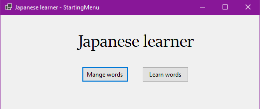
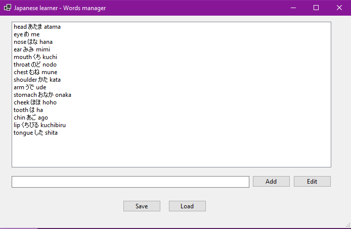
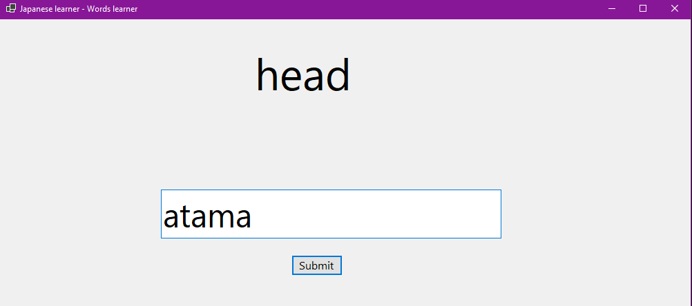
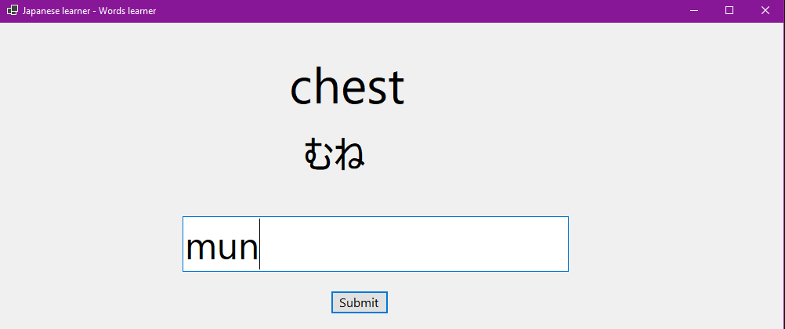
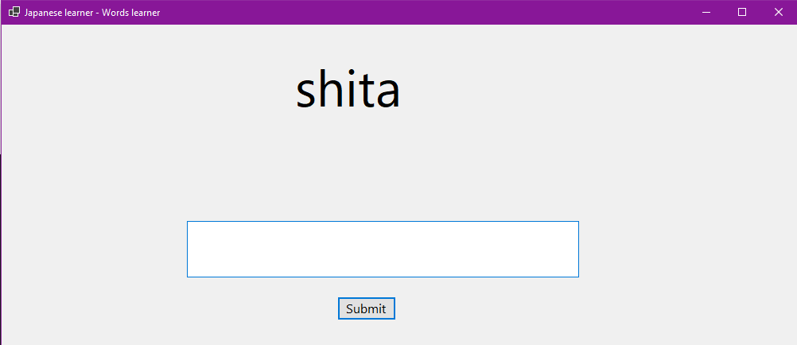
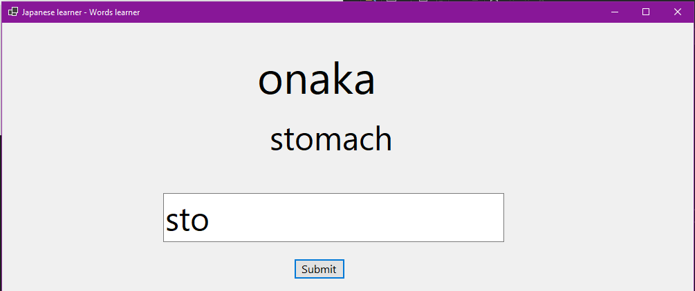

# Japanese self learner
Open source and free tool for learning and testing the knowledge of new Japanese words and expressions. (see bellow for a better description)

## What is the application capable of?

You can add the words you just learned, and you will be able to view what you learned and test yourself in two ways: by viewing the english name and translating them into romaji and by having the romaji version and writing  their translation in english. 

Both ways have hints.

The application starts with the StartingMenu screen where you can choose what you want to do in the application:

* You can add new words (1)
* You can learn and keep practicing the ones you already know (2)  

### Adding new words (1)

The changes will be automatically saved upon the exit and will be loaded upon opening the application. 
For adding new words you need to use the following protocol:
<**word in english**> <**japanese name**> <**romaji description**>
like you see in the word list.

Those words will be saved into a binary file.

### Testing the added words

Two ways of testing: english to Japanese and japanese to english.
The words where you fail to describe will be prioritized, and they will be given again until you learn the pefectly.

#### English to romaji

After one fail to answer you will be given the Japanese representation.

#### Romaji to english

After one fail to answer you will be given the Japanese representation.

